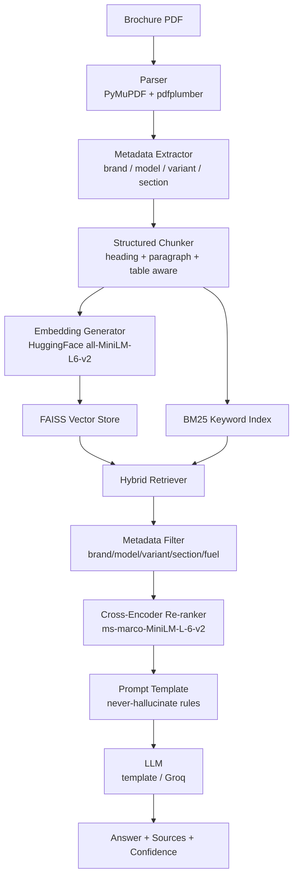
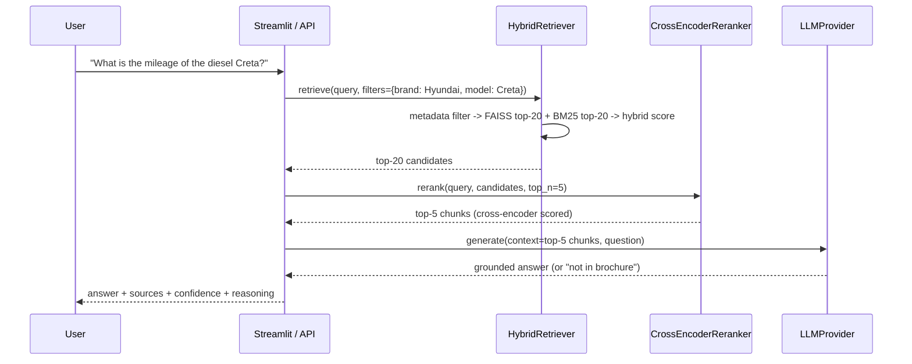

# DriveWise — Metadata-Aware Automotive RAG Assistant

A brochure-grounded conversational assistant for cars. Users ask natural-language
questions ("What is the mileage?", "Does this variant have a sunroof?", "Which
trims get ADAS?") and get answers generated **only** from the retrieved
brochure content — with page-level source citations, a confidence score, and
an explicit refusal sentence when the brochure doesn't cover the question.

> **A note on the data**: no brochure PDFs or dataset files were provided with
> the project brief, and the referenced Kaggle page
> (`drive-wise-problem-statement`) contains only the problem statement
> document, not downloadable brochure files. To make every layer of this
> pipeline genuinely testable end-to-end, `scripts/generate_sample_brochures.py`
> generates three realistic, structured brochure PDFs (Hyundai Creta, Tata
> Nexon, Maruti Suzuki Baleno) with proper headings, sections, and
> specification tables. Drop your own brochure PDFs into `data/brochures/` and
> re-run ingestion to use real brochures instead.

---

## 1. The problem

**Business problem.** Car brochures are long, jargon-heavy PDFs. A buyer who
wants to know "does the diesel variant have a sunroof" has to manually search
through pages of specs tables split across engine, safety, dimensions, and
comfort sections — and cross-reference which trim each feature applies to.

**AI problem.** This is a classic **grounded question-answering** problem: the
model must answer *only* from a restricted, verifiable knowledge base (the
brochure), never from its own general knowledge, and must expose *why* it gave
an answer (which page, which section, which variant) so a buyer can verify it.
A plain LLM call fails this on three counts: (1) it doesn't have the specific
brochure content in its weights, (2) even with the PDF pasted into context it
has no way to attach per-answer, per-chunk **metadata** (which variant/section
a fact applies to), and (3) it has no built-in mechanism to say "I don't know"
instead of guessing.

**Why RAG.** Retrieval-Augmented Generation solves this by separating *what the
model knows* from *what the model is allowed to say*: retrieve only the
brochure passages relevant to the question, and constrain generation to those
passages. Metadata filtering (brand/model/variant/section) narrows retrieval
*before* semantic search runs, which matters a lot here because brochures
repeat similar language across variants ("SX" vs "SX(O)") — pure semantic
search alone would blur these together.

**Key challenges this project addresses:**
- Brochures aren't plain text: tables, headings, and multi-column layouts need
  structure-aware parsing, not a flat text dump.
- Facts are heavily variant-scoped ("sunroof standard from S variant") — losing
  that scoping during chunking silently produces wrong answers.
- Naive fixed-length chunking splits a spec table mid-row, destroying the
  fact it was meant to preserve.
- The system must be able to say "not in the brochure" convincingly and
  consistently, not just when convenient.

---

## 2. Architecture





### Why re-ranking matters here
The first-pass retrievers (FAISS + BM25) score the query against each chunk
*independently* — fast, but blind to fine-grained interaction between query
and chunk terms. The cross-encoder instead scores the (query, chunk) **pair**
jointly through a transformer, so it can tell that a chunk about "SX(O)"
diesel mileage numerically ranks above a superficially-similar chunk about
"SX" petrol mileage, even though both embed close together. Retrieve top-20
cheaply, re-rank only those 20 with the expensive-but-accurate cross-encoder,
keep the top-5 for generation.

---

## 3. Repository layout

```
drivewise/
├── app/
│   ├── config/           # settings.py (env-driven), schemas.py (Pydantic models)
│   ├── ingestion/        # pdf_parser.py, chunker.py
│   ├── embeddings/       # embedder.py (HuggingFace, swappable model)
│   ├── vectorstore/      # faiss_store.py (build/save/load/filtered search)
│   ├── retriever/        # retriever.py (hybrid FAISS + BM25 + metadata filter)
│   ├── reranker/         # cross_encoder_reranker.py
│   ├── chains/           # llm_providers.py, rag_chain.py, pipeline.py (singleton)
│   ├── prompts/          # templates.py (never-hallucinate system prompt)
│   ├── api/              # main.py (FastAPI: /upload /query /search /chunks /metadata)
│   ├── ui/               # streamlit_app.py
│   └── utils/            # logger.py (structured + query monitor), persistence.py
├── data/
│   ├── brochures/        # source PDFs (sample brochures generated here)
│   ├── processed/        # chunks.jsonl + faiss_index/
│   └── uploads/
├── scripts/
│   ├── generate_sample_brochures.py
│   └── ingest.py         # end-to-end ingestion CLI
├── tests/                # pytest suite (43 tests, offline via fake embeddings)
├── requirements.txt
├── Dockerfile
├── docker-compose.yml
├── .env.example
└── README.md
```

---

## 4. Installation & running locally

```bash
git clone <this-repo>
cd drivewise
python -m venv venv && source venv/bin/activate   # Windows: venv\Scripts\activate
pip install -r requirements.txt
cp .env.example .env   # defaults work out of the box (LLM_PROVIDER=template)

# 1. Generate sample brochures (skip if you're supplying your own PDFs)
python scripts/generate_sample_brochures.py

# 2. Run ingestion: parse -> chunk -> embed -> build FAISS index
python scripts/ingest.py

# 3a. Run the API
uvicorn app.api.main:app --reload --port 8000
# -> docs at http://localhost:8000/docs

# 3b. Run the Streamlit UI (separate terminal)
streamlit run app/ui/streamlit_app.py
```

To use your own brochures: drop PDFs into `data/brochures/` and re-run
`python scripts/ingest.py`, or use the `/upload` API endpoint / the sidebar
uploader in the Streamlit app (both re-index automatically).

### Switching the LLM provider
By default `LLM_PROVIDER=template` runs a fully offline, deterministic,
**extractive** answer composer — it only ever surfaces sentences/table rows
that already exist in the retrieved chunks, so hallucination is structurally
impossible, and no API key is required. To use a real generative LLM instead,
set in `.env`:

```
LLM_PROVIDER=groq
GROQ_API_KEY=gsk_...        # from https://console.groq.com/keys
GROQ_MODEL=llama-3.3-70b-versatile
```

Groq hosts open models (Llama 3.x, etc.) on custom LPU hardware, so responses
come back very fast — a good fit for a chat-style assistant.

---

## 5. Running with Docker

```bash
cp .env.example .env
docker-compose up --build
```

- API: http://localhost:8000/docs
- Streamlit UI: http://localhost:8501

The image pre-generates the sample brochures at build time and runs
`scripts/ingest.py` at container start, so both services are immediately
queryable.

---

## 6. API usage

| Endpoint      | Method | Purpose                                                        |
|---------------|--------|------------------------------------------------------------------|
| `/health`     | GET    | Liveness + whether the index is loaded                          |
| `/upload`     | POST   | Upload a brochure PDF (multipart), triggers full re-index       |
| `/query`      | POST   | Full RAG: filter → hybrid retrieve → re-rank → generate → cite  |
| `/search`     | POST   | Retrieval only (no generation) — useful for debugging relevance |
| `/chunks`     | GET    | List/inspect stored chunks, filterable by brand/model/section   |
| `/metadata`   | GET    | Distinct brand/model/variant/section values (for UI filters)    |
| `/docs`       | GET    | Interactive Swagger UI (auto-generated by FastAPI)               |

Example:
```bash
curl -X POST http://localhost:8000/query \
  -H "Content-Type: application/json" \
  -d '{
        "question": "What is the mileage of the diesel variant?",
        "car_brand": "Hyundai",
        "car_model": "Creta"
      }'
```

Response shape (`AnswerResponse`): `answer`, `confidence`, `sources` (document,
section, page, snippet per source), `reasoning_summary`,
`retrieved_chunk_count`, `metadata_filters_applied`, `grounded`.

---

## 7. Testing

```bash
pip install pytest httpx
PYTHONPATH=. pytest tests/ -v
```

43 tests across parser, chunker, hybrid retriever, cross-encoder re-ranker,
end-to-end RAG chain, and FastAPI routes. Tests use deterministic fake
embeddings/cross-encoder (`tests/conftest.py`) so the suite runs fully offline
and fast — this is standard practice for ML-pipeline unit tests; pipeline
*logic* (filtering, hybrid scoring, chunk integrity, prompt/citation
correctness) is fully exercised, while embedding/relevance *quality* is
validated separately by running the real ingestion script.

---

## 8. Project audit

**Folder structure.** Layered by responsibility (ingestion / embeddings /
vectorstore / retriever / reranker / chains / prompts / api / ui / utils), no
circular imports — verified by running the full test suite and both entry
points (`scripts/ingest.py`, `uvicorn app.api.main:app`) successfully.

**Dependency correctness.** `requirements.txt` pins versions to what was
verified working together in this build (LangChain 1.3.x /
langchain-community 0.4.x, sentence-transformers 5.x, faiss-cpu 1.14.x).

**Import validation.** All modules import cleanly; verified via `pytest`
collection and direct script execution.

**Type checking considerations.** All function signatures use Python type
hints; Pydantic models (`app/config/schemas.py`) validate every object crossing
a layer boundary (parser → chunker → vector store → retriever → API).

**Potential runtime errors handled defensively:**
- Missing/corrupted PDFs → `parse_pdf` logs and returns an empty document
  instead of raising, so batch ingestion continues.
- Empty pages / scanned (non-text) PDFs → detected and logged as a warning.
- No FAISS index yet → API returns `503` with an actionable message rather
  than a stack trace; Streamlit shows an inline warning.
- Query with an impossibly narrow metadata filter → returns the required
  `"The provided brochure does not contain this information."` sentence
  rather than crashing or hallucinating.

**Security considerations:**
- `/upload` restricted to `.pdf` extension; consider adding file-size limits
  and virus scanning before production use with untrusted uploads.
- No secrets are logged; API keys are only read from environment variables.
- CORS is wide-open (`*`) for local development — restrict
  `cors_allow_origins` in `.env`/`settings.py` before deploying publicly.
- The `template` LLM provider needs no external API key, minimizing
  credential-exposure surface for demos/evaluation.

**Performance optimizations already in place:**
- Embedding model and cross-encoder are loaded once via `lru_cache`, not
  per-request.
- FAISS index persisted to disk (`data/processed/faiss_index/`) so restarts
  don't require re-embedding.
- Two-stage retrieve-then-rerank (top-20 → top-5) keeps the expensive
  cross-encoder off the full corpus.

**RAG quality improvements for a production follow-up:**
- Add a real evaluation harness for the three metrics named in the brief
  (answer correctness, faithfulness, context relevance) — e.g. via RAGAS —
  rather than the heuristic confidence score currently used.
- Add query rewriting/expansion for very short queries ("mileage?").
- Move from a modal-font-size heading heuristic to native PDF outline/bookmark
  parsing when brochures provide one, for more robust heading detection across
  brochure styles beyond the generated samples.

**Production readiness checklist:**
- [x] Structured logging + per-query JSONL monitoring (`logs/query_log.jsonl`)
- [x] Retry-safe, exception-isolated ingestion (one bad PDF doesn't kill a batch)
- [x] Dockerized, multi-service (API + UI) via docker-compose
- [x] Config fully externalized via `.env`
- [ ] Authentication/rate-limiting on `/upload` and `/query` (add before public deployment)
- [ ] Persistent vector DB migration path to a managed store (Chroma/pgvector) for multi-instance deployments — FAISS here is single-node/local-disk

---

## 9. Future improvements

- ChromaDB backend as a drop-in alternative to FAISS (interface already
  abstracted in `FaissVectorStore` — swap the implementation, keep the
  `build/save/load/similarity_search` contract).
- A proper RAGAS-based evaluation notebook against a held-out question set.
- Multi-turn conversation memory (currently each `/query` call is stateless).
- OCR fallback (e.g. Tesseract) for scanned/image-only brochure pages.
"# Drivewise" 
